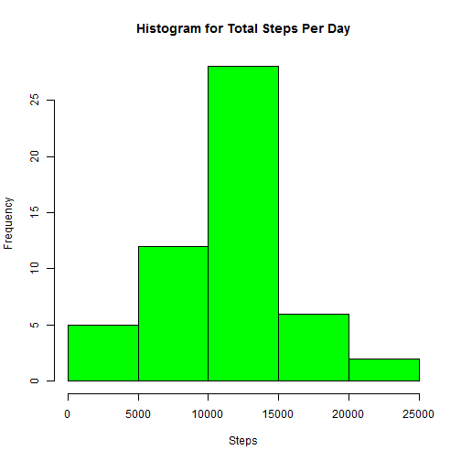

##Data Loading and Pre-Processing
First, your working directory should be set to the folder that holds the data file, activity.csv, or use the full path of the data file to open it with read.csv. Then read the csv file into a data frame called __*steps*__. Finally, convert the __*interval*__ column in the resulting data frame to a factor variable to allow for easier grouping.


```r
#Open the file and import it into a data frame called steps
setwd('C:\\Users\\dave\\Documents\\R\\coursera\\datasciencecoursera\\reproducible')
steps <- read.csv('activity.csv',header=TRUE)

#Set the interval column to a factor
steps$interval<-factor(steps$interval)
```

##What is mean total number of steps taken per day?
Using our __*steps*__ data frame just generated, we first need to generate the total steps each day. Using the __*aggregate(...)*__ function we'll calculate the sum aggregated by day and store it in __*dailyagg*__ and then print those results. Next, we'll print a histogram of the total number of steps taken each day using the __*hist(...)*__ function. Finally, we'll generate the mean and median steps per day from our __*dailyagg*__ object using __*mean(...)*__ and __*median*__ functions and print those.


```r
#Calculate the total number of steps taken per day
dailyagg <- setNames(aggregate(steps$steps,by=list(steps$date),FUN=sum),c("date","steps"))
print(dailyagg)
```

```
##          date steps
## 1  2012-10-01    NA
## 2  2012-10-02   126
## 3  2012-10-03 11352
## 4  2012-10-04 12116
## 5  2012-10-05 13294
## 6  2012-10-06 15420
## 7  2012-10-07 11015
## 8  2012-10-08    NA
## 9  2012-10-09 12811
## 10 2012-10-10  9900
## 11 2012-10-11 10304
## 12 2012-10-12 17382
## 13 2012-10-13 12426
## 14 2012-10-14 15098
## 15 2012-10-15 10139
## 16 2012-10-16 15084
## 17 2012-10-17 13452
## 18 2012-10-18 10056
## 19 2012-10-19 11829
## 20 2012-10-20 10395
## 21 2012-10-21  8821
## 22 2012-10-22 13460
## 23 2012-10-23  8918
## 24 2012-10-24  8355
## 25 2012-10-25  2492
## 26 2012-10-26  6778
## 27 2012-10-27 10119
## 28 2012-10-28 11458
## 29 2012-10-29  5018
## 30 2012-10-30  9819
## 31 2012-10-31 15414
## 32 2012-11-01    NA
## 33 2012-11-02 10600
## 34 2012-11-03 10571
## 35 2012-11-04    NA
## 36 2012-11-05 10439
## 37 2012-11-06  8334
## 38 2012-11-07 12883
## 39 2012-11-08  3219
## 40 2012-11-09    NA
## 41 2012-11-10    NA
## 42 2012-11-11 12608
## 43 2012-11-12 10765
## 44 2012-11-13  7336
## 45 2012-11-14    NA
## 46 2012-11-15    41
## 47 2012-11-16  5441
## 48 2012-11-17 14339
## 49 2012-11-18 15110
## 50 2012-11-19  8841
## 51 2012-11-20  4472
## 52 2012-11-21 12787
## 53 2012-11-22 20427
## 54 2012-11-23 21194
## 55 2012-11-24 14478
## 56 2012-11-25 11834
## 57 2012-11-26 11162
## 58 2012-11-27 13646
## 59 2012-11-28 10183
## 60 2012-11-29  7047
## 61 2012-11-30    NA
```

```r
#Make a histogram of the total number of steps taken each day.
hist(dailyagg$steps,
      main="Histogram for Total Steps Per Day",
      xlab="Steps",
      col="green")
```

 

```r
#Calculate and report the mean and median of the total number of steps taken per day
dailystepsmean <- mean(dailyagg$steps,na.rm=TRUE)
dailystepsmedian <- median(dailyagg$steps,na.rm=TRUE)

sprintf("Mean daily steps: %g", dailystepsmean)
```

```
## [1] "Mean daily steps: 10766.2"
```

```r
sprintf("Median daily steps: %i", dailystepsmedian)
```

```
## [1] "Median daily steps: 10765"
```

##What is the average daily activity pattern?
Make a time series plot (i.e. type = "l") of the 5-minute interval (x-axis) and the average number of steps taken, averaged across all days (y-axis). First, we'll calculate the sum of for each time interval and tehn the mean, using the __*aggregate(...)*___ function and then render the plot on the mean calculation.


```r
#Calculate the sum grouped by each time interval
intervalagg <- setNames(aggregate(steps$steps,by=list(steps$interval),FUN=sum, na.rm=TRUE),c("interval","steps"))

#Now calculate the mean at each interval
intervalagg <- aggregate(steps ~ interval, steps, mean)
intervalagg$timeinterval <- strptime(sprintf("%02d:%02d", 
                                             as.numeric(levels(intervalagg$interval)) %/% 100, 
                                             as.numeric(levels(intervalagg$interval)) %% 100), 
                                     format="%H:%M")

#Now render the plot
plot(intervalagg$timeinterval, 
  intervalagg$steps, 
  type="l", 
  col="blue", 
  main="Steps Taken Throughout the Day",
  xlab="Time Interval (5-minute increments)", 
  ylab="Step Count")
```

 

Which 5-minute interval, on average across all the days in the dataset, contains the maximum number of steps?


```r
#Get the maximum number of steps by interval
maxinterval <- as.character(intervalagg$interval[which.max(intervalagg$steps)])
sprintf("Time interval with maximum steps: %s",maxinterval)
```

```
## [1] "Time interval with maximum steps: 835"
```

##Imputing missing values
Calculate and report the total number of missing values in the dataset (i.e. the total number of rows with NAs)

```r
#Count the NA steps
sprintf("Total number of missing values: %i", sum(is.na(steps$steps)))
```

```
## [1] "Total number of missing values: 2304"
```

Devise a strategy for filling in all of the missing values in the dataset. Create a new dataset that is equal to the original dataset but with the missing data filled in. 

We're going to solve this problem by replacing missing values with the rounded value of the mean from the same time interval with values. First, we need a vector of the missing values. Then we'll create a copy of the original __*steps*__ dataframe so we can safely make edits, called __*imputedsteps*__. Finally, we'll loop through the vector of missing values and for each matching cell in imputedsteps dataframe, we'll place the rounded mean value from __*intervalagg*__ which contains the mean values.


```r
#Generate a vector of all of our NAs
missing <- which(is.na(steps$steps))

#Copy the original data frame to one we can safely modify
imputedsteps <- steps

#Loop through the missing vector, replacing the same index in the 
#imputedsteps data frame with the rounded value of the mean in the 
#intervalagg data frame with matching interval value
for (i in missing) {
    imputedsteps$steps[i] <- 
      with(intervalagg, round(steps[interval == imputedsteps$interval[i]]),0)
}
```

Make a histogram of the total number of steps taken each day and calculate and report the mean and median total number of steps taken per day. Do these values differ from the estimates from the first part of the assignment? What is the impact of imputing missing data on the estimates of the total daily number of steps?


```r
#Calculate the step sums by day
imputeddailyagg <- setNames(aggregate(imputedsteps$steps,
                                      by=list(imputedsteps$date),
                                      FUN=sum),
                            c("date","steps"))

#Create the histogram of steps per day
hist(imputeddailyagg$steps,
      main="Histogram for Imputed Total Steps Per Day",
      xlab="Steps",
      col="green")
```

 

```r
#Get the daily mean and median steps
impdailystepsmean <- mean(imputeddailyagg$steps,na.rm=TRUE)
impdailystepsmedian <- median(imputeddailyagg$steps,na.rm=TRUE)

sprintf("Mean daily imputed steps: %g", impdailystepsmean)
```

```
## [1] "Mean daily imputed steps: 10765.6"
```

```r
sprintf("Median daily imputed steps: %i", impdailystepsmedian)
```

```
## [1] "Median daily imputed steps: 10762"
```

The imputed mean and median steps vary only slightly from the non-imputed values.

##Are there differences in activity patterns between weekdays and weekends?

Create a new factor variable in the dataset with two levels - "weekday" and "weekend" indicating whether a given date is a weekday or weekend day. To accomplish this we'll use the __*weekdays(...)*__ function along with __*strptime(...)*__ on the __*date*__ column, all wrapped in a ifelse statement that compares the weekdays return name to "Saturday" and "Sunday". If there is a match, set the new column = "weekend", otherwise it is a "weekday".


```r
#Create a new column in the imputedsteps data frame called dayclass that holds "weekend" or "weekday" based on the weekdays() return value
imputedsteps$dayclass<-ifelse(weekdays(strptime(levels(imputedsteps$date), 
                                                format="%Y-%m-%d")) %in% c("Saturday","Sunday"), 
                              "weekend", 
                              "weekday")
imputedsteps$dayclass <- as.factor(imputedsteps$dayclass)

#Set the new column to a factor type
imputedsteps$dayclass<-as.factor(imputedsteps$dayclass)
```

Make a panel plot containing a time series plot (i.e. type = "l") of the 5-minute interval (x-axis) and the average number of steps taken, averaged across all weekday days or weekend days (y-axis). First we'll create a data frame called __*imputemean*__, that contains the mean for each day and interval. Then we'll use the lattice system to print the chart.


```r
imputemean <- setNames(
  aggregate(imputedsteps$steps, 
            by=list(imputedsteps$dayclass,imputedsteps$interval), 
            FUN=mean),
  c("dayclass","Interval","Steps"))

library(lattice)
xyplot(Steps ~ Interval | dayclass, 
       data=imputemean, type="l", 
       layout=c(1,2), 
       ylab = "Mean Step Count", 
       main="Mean Steps Per 5-Minute Interval, Weekend vs Weekday")
```

 
